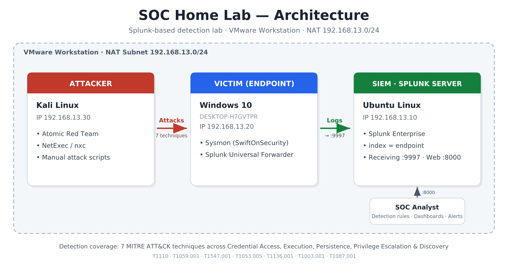
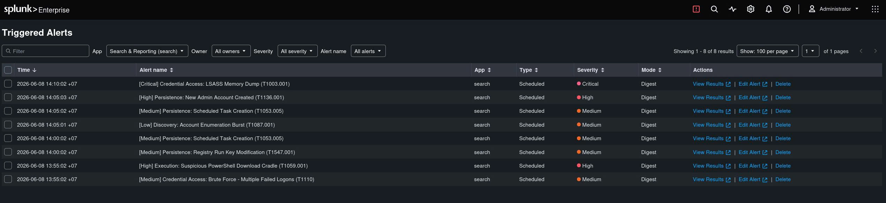
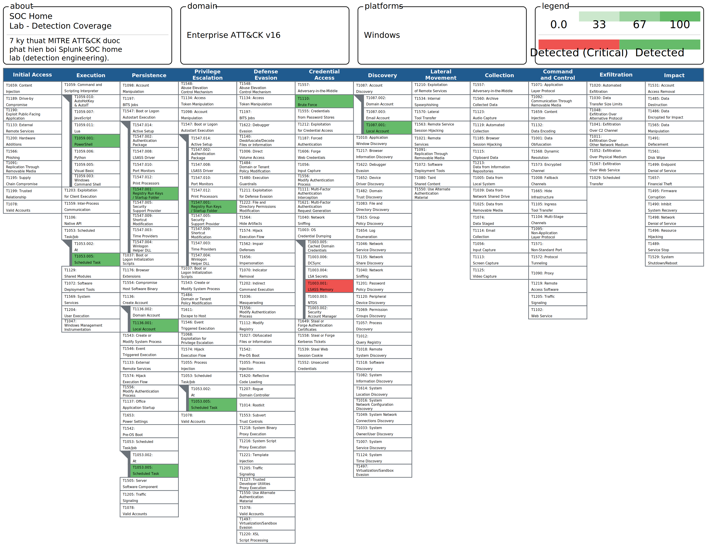
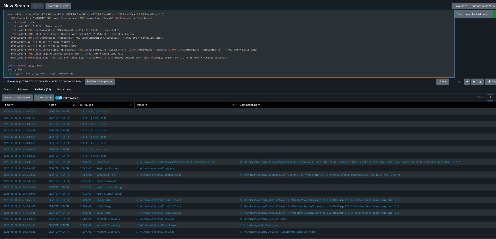

# 🛡️ SOC Home Lab — Splunk Detection Engineering

> Một Security Operations Center thu nhỏ, tự xây trên VMware: thu thập log endpoint, viết 7 detection rule map MITRE ATT&CK, mô phỏng chuỗi tấn công đa giai đoạn, và điều tra dựng lại toàn bộ kill chain.

  

## 📌 Tổng quan

Dự án này mô phỏng công việc thật của một SOC analyst: từ **thu thập log → kỹ thuật phát hiện (detection engineering) → mô phỏng tấn công → điều tra sự cố → báo cáo**. Mục tiêu là thể hiện năng lực blue team end-to-end, không chỉ "biết cài công cụ".

**Kỹ năng thể hiện:** SIEM (Splunk SPL), detection engineering, giảm false positive, MITRE ATT&CK, mô phỏng tấn công (Atomic Red Team), điều tra & viết báo cáo sự cố.

## 🏗️ Kiến trúc Lab



| Thành phần | Vai trò | OS | IP |
|---|---|---|---|
| Splunk Server | SIEM / Indexer | Ubuntu | 192.168.13.10 |
| Victim | Endpoint (Sysmon + Universal Forwarder) | Windows 10 | 192.168.13.20 |
| Attacker | Kali (Atomic Red Team, nxc) | Kali Linux | 192.168.13.30 |

- Subnet NAT `192.168.13.0/24` trên VMware.
- Endpoint chạy **Sysmon (config SwiftOnSecurity)** + **Splunk Universal Forwarder** đẩy Security & Sysmon log về index `endpoint`.

## 🔍 Detection Coverage — 7 Rule map MITRE ATT&CK



| # | Rule | Technique | Tactic | Severity | Nguồn log |
|---|---|---|---|---|---|
| 1 | Brute Force | T1110 | Credential Access | Medium | Security 4625 |
| 2 | Malicious PowerShell | T1059.001 | Execution | High | Sysmon EID 1 |
| 3 | Registry Run Key | T1547.001 | Persistence | Medium | Sysmon EID 13 |
| 4 | Scheduled Task | T1053.005 | Persistence | Medium | Sysmon EID 1 |
| 5 | New Admin Account | T1136.001 | Persistence | High | Security 4720/4732 |
| 6 | LSASS Dumping | T1003.001 | Credential Access | Critical | Sysmon EID 1/11 |
| 7 | Account Discovery | T1087.001 | Discovery | Low | Sysmon EID 1 |

*Câu SPL đầy đủ trong thư mục [`detection-rules/`](detection-rules/).*

### 🗺️ MITRE ATT&CK Navigator


## ⚔️ Kịch bản tấn công mô phỏng

Chuỗi tấn công đa giai đoạn được tái hiện bằng Atomic Red Team + công cụ tay:

```
Brute Force (T1110) → PowerShell (T1059.001) → Persistence (Registry T1547.001 + Task T1053.005)
   → New Admin (T1136.001) → LSASS Dump (T1003.001) → Discovery (T1087.001)
```

### Timeline dựng lại từ log


Xem điều tra & báo cáo đầy đủ trong [`reports/incident-report.md`](reports/incident-report.md).

## 💡 Bài học & thử thách kỹ thuật

- **Giảm false positive:** rule Registry Run key ban đầu dính cả chuỗi "Runtime" và Edge AutoLaunch → phải thêm bộ lọc loại trừ. Đây là phần khó nhất của detection engineering.
- **Scheduled vs Real-time alert:** rule theo ngưỡng/hành vi (brute force, discovery burst) phải dùng **Scheduled** vì cần gom-đếm theo cửa sổ thời gian; Real-time không xử lý được search dạng `stats ... | where count >= N`.
- **Phủ nhiều biến thể:** rule LSASS bắt cả `procdump` lẫn `comsvcs.dll` LOLBin — mạnh hơn nhiều so với bắt đúng một công cụ.
- **Lab thật có ma sát:** lỗi quyền (errorCode=5), lệch đồng hồ server, account lockout — đều phải tự chẩn đoán & xử lý.

## 🚀 Hướng phát triển

- Bật Sysmon EID 10 để bắt truy cập LSASS trực tiếp.
- Chuyển rule sang định dạng **Sigma** để dùng đa nền tảng.
- Thêm correlation search (vd 4720 → 4732 trong vài giây).
- Tích hợp threat intel feed cho IOC.

## 🛠️ Tech Stack

`Splunk Enterprise` · `Sysmon` · `Splunk Universal Forwarder` · `Atomic Red Team` · `Kali / NetExec` · `MITRE ATT&CK Navigator` · `VMware`


*Dự án học tập — mọi hoạt động tấn công thực hiện trong môi trường lab cô lập, có kiểm soát.*
